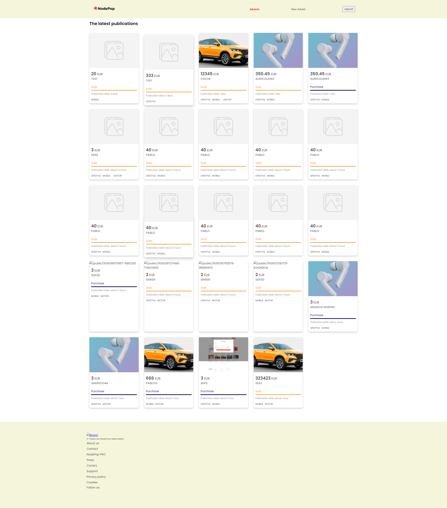
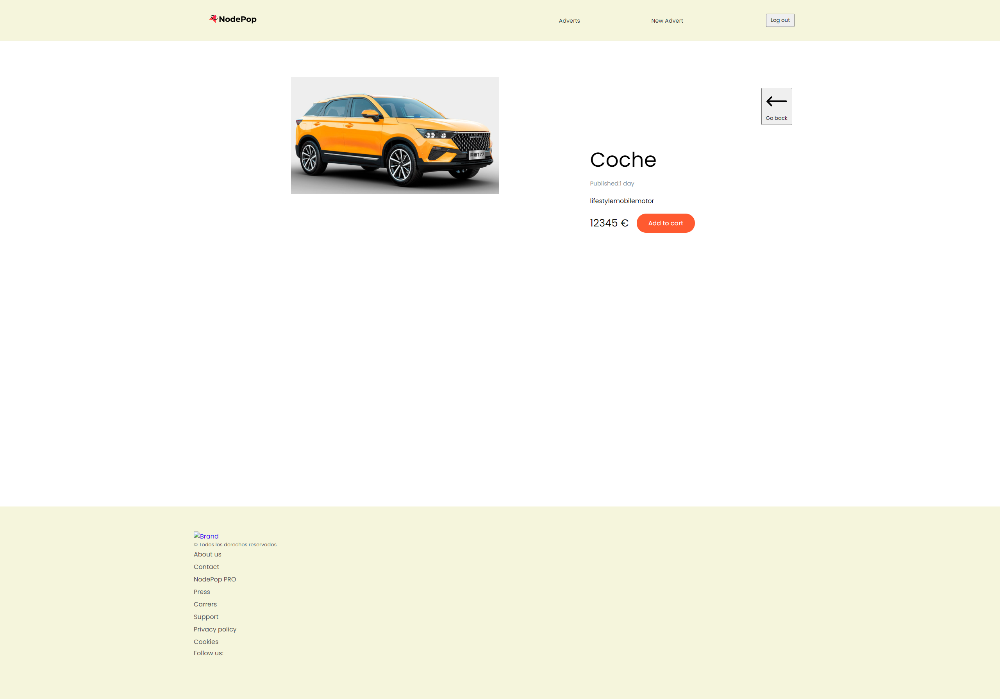
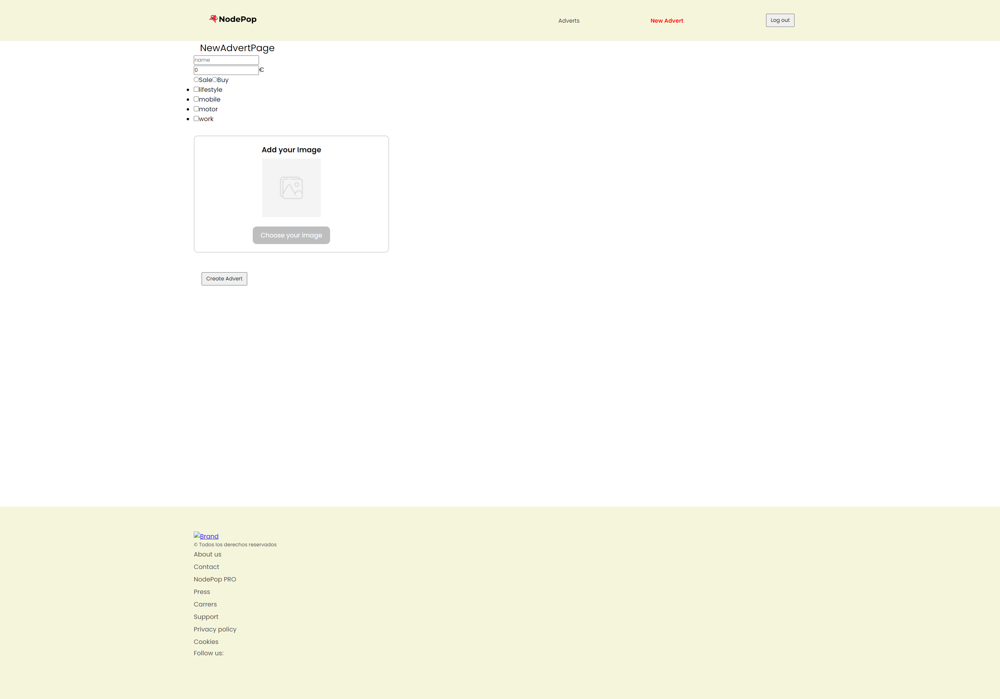

# Entrega de la práctica del módulo 07 Fundamento de React

Práctica orientada a la creación de un frontend completo con React, sin la utilización de ninguna librería o framework adicional.

# Instalación servidor de pruebas

La tarea está basada en el uso del servidor **nodepop-api**. Se pueden seguir las instrucciones de instalación desde el siguiente link: https://github.com/davidjj76/nodepop-api

    git clone https://github.com/davidjj76/nodepop-api.git

Con el servidor instalado, es necesario realizar el mismo proceso con el proyecto front-end, para ello se debe clonar el proyecto desde esta dirección: https://gitkc.cloud/pablopsdigital/web11_modulo07_fundamentos_de_react_practica

    git clone https://gitkc.cloud/pablopsdigital/web11_modulo07_fundamentos_de_react_practica.git

Finalmente se instalan las dependencias de ambos proyectos ejecutando

    npm init

y por último se levantaran cada uno de los proyectos ejecutando

    npm start

Se puede comprobar si el servidor se encuentra funcionando añadiendo la siguiente url en el navegador de forma que se obtendrá una lista de anuncio en formato json.
http://localhost:3001/api/v1/adverts

Se puede acceder a la documentación del api en la ruta:
http://localhost:3001/swagger/#/

## Capturas

